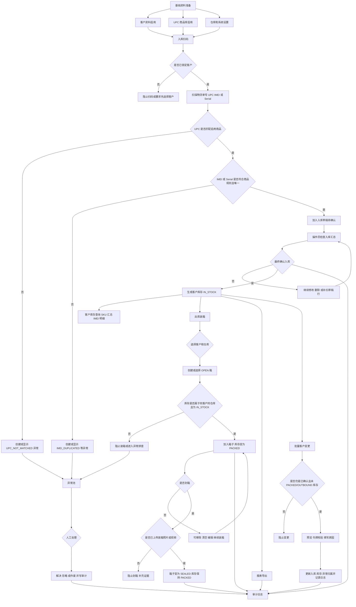
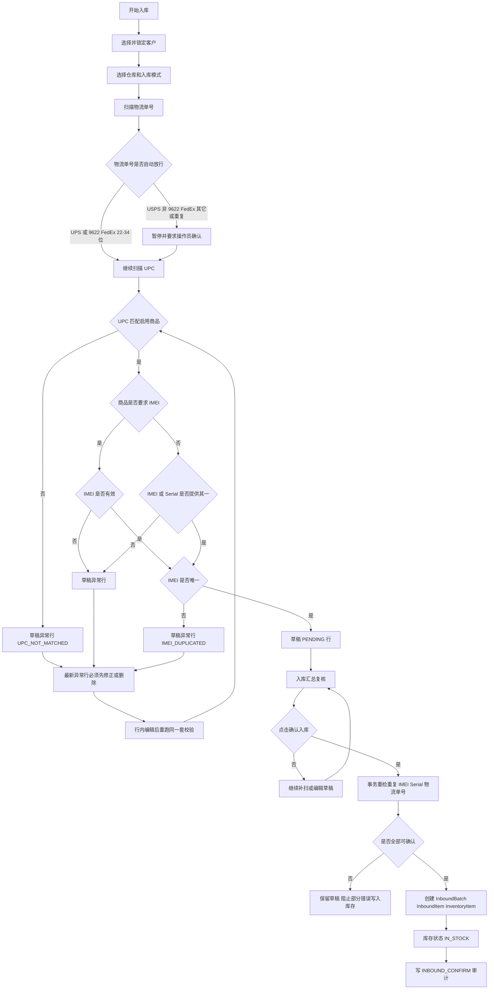
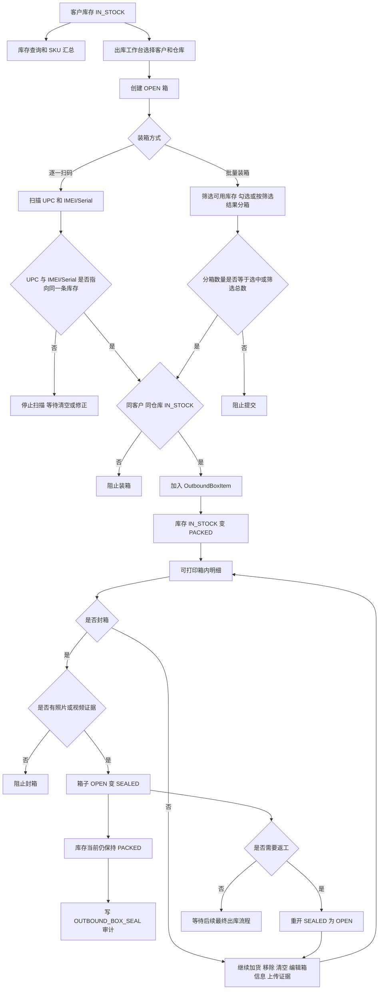
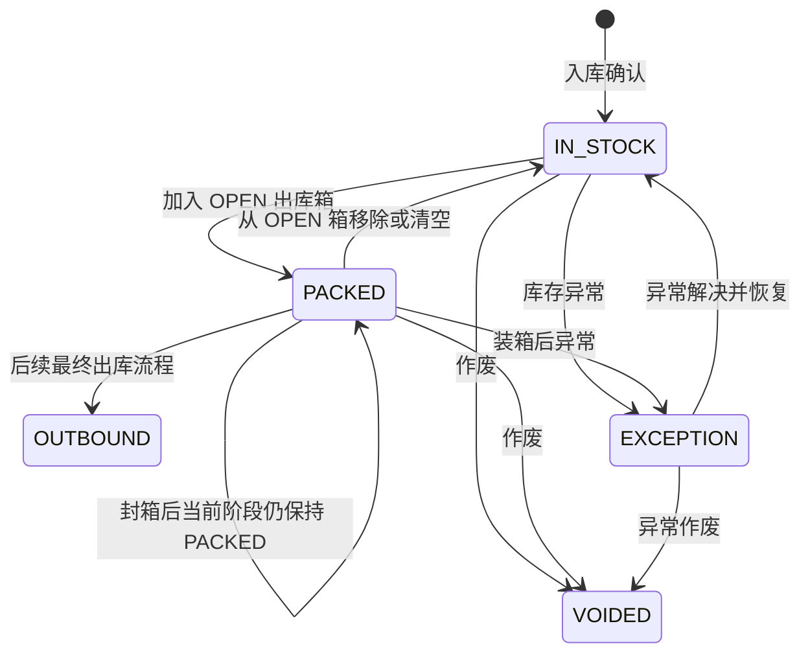
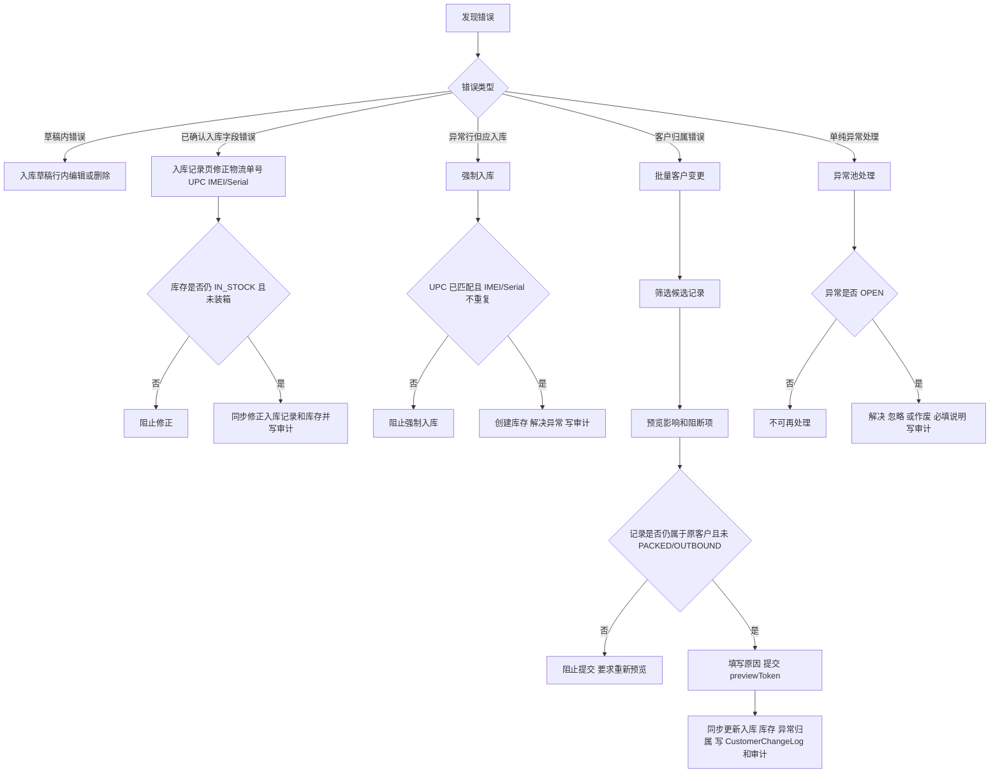

# Business Logic Map

这份文档用于从业务角度检查 WMS Scan 的整体步骤、关键判断点和状态流转是否合理。

## Overall Flow

## Inbound Detail

## Inventory And Outbound Detail

## Inventory State Machine

## Correction And Exception Paths

## Logic Checkpoints

1. 客户归属只能在入库前锁定；出库不能重新分配客户。
2. UPC 是商品识别入口；未匹配启用商品时不能生成正常库存。
3. IMEI/Serial 是单件追踪入口；重复值不能进入库存，即使强制入库也不能绕过。
4. 入库确认必须是最终人工点击，不能由扫码或文件导入自动确认。
5. 入库草稿异常行必须先修正或删除，避免操作员带着错误继续扫下一行。
6. 出库只能操作同客户、同仓库、`IN_STOCK` 库存。
7. 装箱后库存变为 `PACKED`；当前系统封箱后仍保持 `PACKED`，`OUTBOUND` 留给后续最终出库流程。
8. 封箱必须有照片或视频证据。
9. 已 `PACKED` 或 `OUTBOUND` 的库存不能批量改客户，也不能通过入库记录修正静默改历史。
10. 异常处理、批量改客户、入库确认、封箱、报表导出都必须写审计日志。

## Potential Questions To Confirm

1. 当前封箱后库存保持 `PACKED`，不是立即变 `OUTBOUND`。如果业务上“封箱=已经出库”，需要新增最终出库规则或调整状态机。
2. 重复物流单号在同一草稿内允许，因为一个包裹可以有多件货；但历史已确认重复会产生异常信号。这个规则需要现场确认是否符合实际收货。
3. `物流+UPC 模式` 允许没有 IMEI/Serial 的草稿行，但确认入库时仍受商品规则和唯一性校验约束。若现场希望这种模式直接生成无 IMEI 库存，需要单独明确适用商品范围。
4. 批量客户变更只能处理未装箱或未出库库存。如果现场经常在装箱后发现客户错误，应先设计“重开/移除/改客户/重新装箱”的标准操作。
