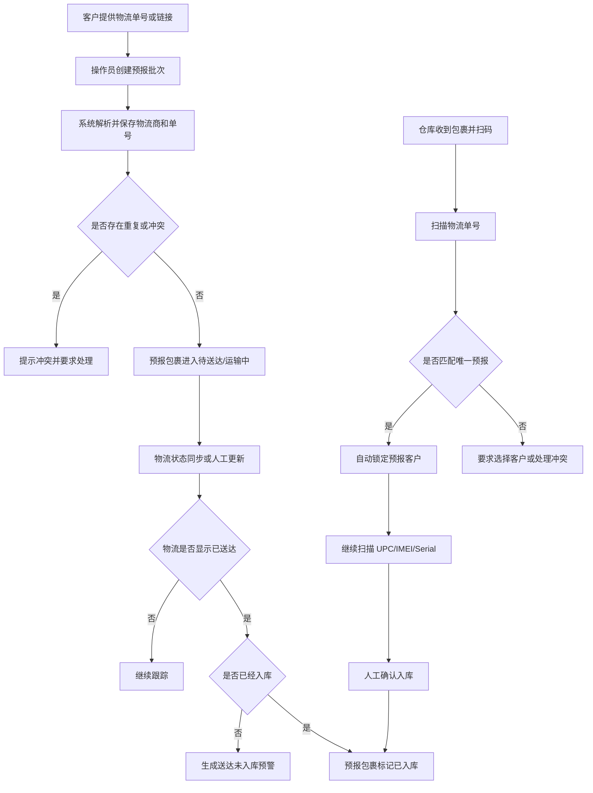

# Package Prealert PRD

## 1. Background

仓库当前的核心入库流程从“选择客户并扫码”开始。实际业务中，客户会在包裹到仓前通过物流单号或物流链接提前告知仓库，但仓库收到包裹时，经常只知道包裹上的物流单号，不一定知道它属于哪个客户。

这会产生三个风险：

- 包裹物流显示已送达，但仓库没有及时发现或没有及时入库。
- 操作员扫码时不知道包裹属于哪个客户，容易选错客户或需要人工查聊天记录。
- 客户预报数量、物流送达数量、实际入库数量之间没有统一看板，丢件、漏扫、延迟入库不容易被发现。

本 PRD 只描述新增的“包裹预报与预警”功能，不改变现有库存、出库、报表主流程。

## Current Runtime Status

2026-07-09 起，包裹预报代码、页面、API、数据库结构和文档先保留在仓库中，但运行时默认关闭。
默认关闭时，系统回到包裹预报上线前的操作方式：

- 左侧菜单不显示“包裹预报”和“包裹预警”。
- 入库扫码不再根据预报单号自动匹配或切换客户。
- 确认入库不再自动关联预报记录或关闭预报预警。
- `/package-prealerts` 后端接口返回功能关闭状态，不参与日常操作。

后续决定继续启用时，同时设置：

```bash
PACKAGE_PREALERTS_ENABLED=true
VITE_ENABLE_PACKAGE_PREALERTS=true
```

然后重启 API 并重新构建/启动 Web，即可恢复该功能。代码和历史数据结构不需要重新开发。

## 2. Product Goal

新增一个入库前置功能，让系统能记录客户预报的物流单号，并根据物流状态和实际入库情况自动发现风险。

核心目标：

1. 客户预报时必须绑定客户和物流单号。
2. 仓库扫码入库时，只扫物流单号即可自动匹配客户。
3. 物流显示已送达但尚未入库时，系统必须预警。
4. 系统必须展示预计到达时间、实际送达时间、当前物流状态和物流轨迹。
5. 包裹长时间未更新、重复预报、冲突预报时，系统必须提示。
6. 外部物流系统可接入时自动同步状态和时间；暂时无法接入时，系统仍可通过人工导入或手动更新状态运转。

## 3. Scope

### 3.1 In Scope

- 包裹预报批次创建。
- 单条或批量导入客户预报物流单号。
- 保存客户、物流商、物流单号、物流链接和预报来源。
- 支持客户只提供 Apple 订单链接或其他订单查询链接；系统先保存订单引用，后续由同步器解析真正快递单号和 ETA。
- 从常见物流链接中解析物流单号。
- 预报单号重复、客户冲突、格式异常提示。
- 入库扫码时按物流单号自动匹配客户。
- 预报包裹和入库批次自动关联。
- 物流状态保存和状态历史记录。
- 预计到达时间和实际送达时间保存、更新和展示；预计到达时间来自物流查询结果，不由预报录入人员手动填写。
- 包裹状态可视化看板、状态标签和物流时间线。
- 送达未入库、长时间未更新、预报未到仓等预警。
- 预报批次、包裹明细、预警列表、统计看板。
- 为后续第三方物流系统接入预留同步状态和同步日志。

### 3.2 Out Of Scope

- 不直接把预报包裹变成库存。
- 不自动确认入库。
- 不自动创建出库箱。
- 不替代现有 UPC、IMEI、Serial 校验。
- 不在第一版强依赖外部物流系统必须可接入。
- 不在第一版处理客户在线门户提交，先由内部操作员录入或导入。

## 4. Key Definitions

| Term                   | Meaning                                                                                     |
| ---------------------- | ------------------------------------------------------------------------------------------- |
| Package Prealert       | 客户提前告知仓库将到达的包裹信息。                                                          |
| Prealert Batch         | 一次客户预报形成的批次，可包含多个物流单号。                                                |
| Tracking Number        | UPS、USPS、FedEx 或其他承运商物流单号。                                                     |
| Tracking Link          | 客户提供的物流查询链接，系统尽量解析出物流商和单号。                                        |
| Order Link             | 客户提供的 Apple 订单链接或第三方订单查询链接，可能需要系统后续查询后才能得到真正物流单号。 |
| Logistics Status       | 外部物流状态，如运输中、已送达、异常、无法识别。                                            |
| Estimated Arrival Time | 外部物流系统或物流商返回的预计到达时间。                                                    |
| Delivered Time         | 外部物流显示包裹已经送达的实际时间。                                                        |
| Receiving Status       | WMS 内部状态，如未扫码入库、部分入库、已入库、已作废。                                      |
| Alert                  | 系统发现风险后生成的提醒，如已送达但未扫码。                                                |

## 5. User Roles

| Role       | Needs                                                  |
| ---------- | ------------------------------------------------------ |
| 仓库操作员 | 扫包裹单号时自动知道客户，减少人工查找和选错客户。     |
| 客服/运营  | 录入客户预报，查看客户预报数量、到仓数量和未入库数量。 |
| 主管       | 查看异常预警，追踪丢件、漏扫、长时间未送达问题。       |
| 系统管理员 | 配置物流同步、预警阈值、权限和外部系统接入信息。       |

## 6. Business Flow



## 7. Functional Requirements

### 7.1 Package Prealert Page

新增页面：`包裹预报`。

页面能力：

- 新建预报批次。
- 选择客户。
- 录入单个物流单号、物流链接或 Apple 订单链接。
- 批量粘贴多行物流单号、物流链接或 Apple 订单链接。
- 上传 CSV/Excel 文件导入，兼容表头 `预报仓库`、`单号`、`邮箱`、`名字`、`超链接`。
- 导入模板里有 `型号`、`姓名` 或 `名字` 时，系统保存并用于外部预报推送；没有这些字段时不编造。
- 查看预报批次列表。
- 查看批次内包裹明细。
- 包裹明细需要分页，支持每页条数切换，搜索条件变化后回到第一页。
- 编辑未入库的预报包裹仓库。
- 删除/作废错误预报，支持单条删除、勾选删除和批量删除。

批次列表建议字段：

| Field      | Description                              |
| ---------- | ---------------------------------------- |
| 预报批次号 | 系统生成，例如 `PRE-20260706-0001`。     |
| 客户       | 预报归属客户。                           |
| 预报数量   | 批次内包裹数量。                         |
| 已送达     | 物流状态为已送达的数量。                 |
| 已入库     | 已关联入库批次的数量。                   |
| 已送达但未扫码 | 已送达但 WMS 未扫码入库数量。       |
| 异常       | 重复、冲突、物流异常或长时间未更新数量。 |
| 创建人     | 创建预报的操作员。                       |
| 创建时间   | 批次创建时间。                           |

包裹明细建议字段：

| Field             | Required | Description                                                                       |
| ----------------- | -------- | --------------------------------------------------------------------------------- |
| 客户              | Yes      | 从预报批次继承，不允许单条包裹随意改客户。                                        |
| 物流商            | No       | UPS、USPS、FedEx、Other、Unknown。                                                |
| 物流单号/订单引用 | Yes      | 已解析到快递单号时保存标准化物流单号；暂未解析时保存订单引用，例如 Apple 订单号。 |
| 原始链接          | No       | 客户提供的原始物流链接或订单链接。                                                |
| 当前物流状态      | Yes      | `UNKNOWN`、`IN_TRANSIT`、`OUT_FOR_DELIVERY`、`DELIVERED`、`EXCEPTION` 等。        |
| 最新物流时间      | No       | 外部物流状态最后更新时间。                                                        |
| 预计到达时间      | No       | 外部物流系统或物流商返回的预计到达时间，可随同步更新。                            |
| 送达时间          | No       | 物流显示 delivered 的时间。                                                       |
| 物流轨迹          | No       | 最近若干条物流事件，包括时间、地点和状态说明。                                    |
| 入库状态          | Yes      | `NOT_RECEIVED`、`PARTIALLY_RECEIVED`、`RECEIVED`、`VOIDED`。                      |
| 入库批次号        | No       | 确认入库后自动关联。                                                              |
| 预警状态          | Yes      | 正常、预警中、已处理。                                                            |
| 仓库              | No       | 客服录入或 Excel 导入的预报仓库代码，例如 `BB-DE-252-2`。                         |
| 型号              | No       | Excel 导入或后续可信同步写入的产品型号，用于推送到外部 `预报` 表。                |
| 姓名              | No       | Excel 导入的收件人或姓名参考，用于推送到外部 `预报` 表。                          |

### 7.2 Tracking Link Parsing

系统应尽量从客户提供的链接中解析物流商和物流单号。

第一版建议支持：

- UPS 链接中的 `tracknum`、`trackingNumber` 或明显的 `1Z...` 单号。
- USPS 链接中的 `tLabels`、`trackingNumber` 或 20 到 34 位数字单号。
- FedEx 链接中的 `trknbr`、`tracknumbers` 或常见 FedEx 数字单号。
- Apple 订单链接中的订单号，例如 `/vieworder/W.../...`；该值不是快递单号，只能作为后续查询订单状态的引用。

解析规则：

- 保存原始链接，不能只保存解析结果。
- 解析出快递单号时保存标准化物流单号。
- 只解析出订单号时保存订单引用，物流状态、快递单号和 ETA 仍等待后续同步器查询。
- 解析失败时保留链接用于追溯，并提示该链接暂时无法自动识别。
- 同一个链接中解析出多个单号时，要求操作员确认或拆成多条预报记录。

Apple 订单同步器规则：

- 系统不能只读取 Apple 订单链接的初始 HTML，因为该页面可能不会直接暴露承运商快递单号。
- Apple 订单链接也不保证能直接暴露产品型号；如果页面被动态加载、验证码、登录或邮箱验证拦截，系统只能保存订单链接，不应猜测型号。
- 同步器需要打开 Apple 订单页面，等待订单详情加载完成，定位并点击页面中的 `trackingNumber` 字段或同等追踪入口。
- 点击后如果跳转到 UPS、USPS、FedEx 或其他承运商页面，系统应从跳转 URL 或承运商页面解析真实快递单号、承运商、预计到达时间、送达时间和轨迹。
- 如果点击后只是展开 Apple 页面内的追踪详情，系统应从展开区域读取承运商、真实快递单号、ETA、送达时间和轨迹。
- 如果 Apple 页面要求验证码、登录、邮箱验证或其他人工校验，系统应把该预报标记为 `UNKNOWN` 或同步失败预警，不应编造快递单号或 ETA。
- 如果导入模板已经提供 `型号` 或 `姓名`，系统可以直接保存并推送这些人工提供字段；这不依赖 Apple 页面解析。

### 7.3 Duplicate And Conflict Rules

物流单号是包裹预报匹配客户的关键字段。

规则：

1. 同一个有效物流单号不能同时被多个未作废预报记录绑定到不同客户。
2. 同一客户重复预报同一物流单号时，系统提示重复，不默认创建第二条。
3. 不同客户预报同一物流单号时，必须生成冲突状态，处理完成前不得用于自动锁定客户。
4. 已入库的预报包裹不能静默改客户，如归属错误，必须走批量客户变更或专门的纠错流程。
5. 删除预报在系统内按作废处理，必须写入作废原因和审计日志。
6. 已入库或已经关联入库批次的预报不能在预报页删除。
7. 批量删除只作废可删除的预报；已入库、已关联入库或已作废的记录必须跳过并返回原因。

### 7.4 Inbound Auto-Match Customer

现有入库要求先选择并锁定客户。新增预报功能后，入库页需要支持“扫预报单号自动匹配客户”。

规则：

- 操作员扫描物流单号后，系统先查询是否存在唯一有效预报记录。
- 如果匹配到唯一预报，自动带出并锁定客户。
- 页面提示：`已匹配客户：客户名，来源：预报批次号`。
- 后续 UPC、IMEI、Serial 仍按现有入库规则校验。
- 最终仍需要人工点击确认入库。
- 确认入库后，预报包裹自动关联入库批次和入库明细。

异常处理：

| Situation      | System Behavior                                                      |
| -------------- | -------------------------------------------------------------------- |
| 未找到预报     | 提示未预报，允许按现有流程手动选择客户继续入库，并标记为未预报入库。 |
| 匹配多个客户   | 阻止自动锁定，提示冲突客户，要求先处理预报冲突。                     |
| 预报已作废     | 不用于自动匹配，提示该单号存在已作废预报。                           |
| 预报客户停用   | 阻止入库，要求先启用客户或更正预报。                                 |
| 预报已关联入库 | 提示历史入库批次，按现有重复物流单号规则继续判断。                   |

### 7.5 Logistics Status Sync

系统需要为物流状态同步预留能力。

支持三种模式：

1. 外部物流系统 API 同步。
2. UPS、USPS、FedEx 官方接口同步。
3. 人工导入或手动更新物流状态。

第一版如果外部系统无法对接，仍必须支持模式 3，保证预警功能先落地。

自动更新能力要求：

- 如果外部物流系统或官方物流商返回预计到达时间，系统必须自动写入 `estimatedArrivalAt`。
- 如果后续同步返回新的预计到达时间，系统必须保留最新值，并在物流事件历史中记录一次 ETA 变化。
- 如果物流状态变为已送达，系统必须自动写入 `deliveredAt`，并触发送达未入库判断。
- 如果数据源只返回“已送达”但不返回具体送达时间，系统使用该物流事件时间作为 `deliveredAt`；仍无事件时间时，使用同步时间并标记为系统推定时间。
- 如果外部系统没有 ETA 字段，系统不应自行编造预计到达时间，只展示为空或未知。

同步字段：

| Field        | Description                           |
| ------------ | ------------------------------------- |
| 物流状态     | 当前标准化状态。                      |
| 原始状态文本 | 外部系统返回的原始描述。              |
| 最新物流时间 | 状态发生时间。                        |
| 预计到达时间 | 外部系统或物流商返回的 ETA。          |
| 送达时间     | delivered 时间。                      |
| 签收人       | 如外部系统提供则保存。                |
| 签收地点     | 如外部系统提供则保存。                |
| 物流轨迹     | 外部系统返回的状态事件列表。          |
| 同步来源     | API、官方物流商、人工导入、手动编辑。 |
| 同步时间     | WMS 获取该状态的时间。                |

同步失败规则：

- 保存失败原因和失败时间。
- 不清空上一次成功状态。
- 连续失败达到阈值后生成同步异常预警。

### 7.6 Logistics Status Visualization

包裹预报和包裹预警页面必须让操作员直观看到包裹当前状态，不应只依赖打开详情或查看原始链接。

列表页展示：

| UI Element | Description                                            |
| ---------- | ------------------------------------------------------ |
| 状态标签   | 用颜色区分未知、运输中、派送中、已送达、异常、已入库。 |
| 预计到达   | 展示 ETA；没有 ETA 时显示 `未知`。                     |
| 实际送达   | 已送达时展示 delivered 时间；未送达时为空。            |
| 最后更新   | 展示最近一次物流事件时间或同步时间。                   |
| 风险标识   | 送达未入库、ETA 已过、长时间未更新、同步失败等。       |

详情页展示：

- 顶部状态条：`已预报 -> 运输中 -> 派送中 -> 已送达 -> 已入库`。
- 当前状态卡：显示物流商、物流单号、当前状态、预计到达时间、实际送达时间、最后更新时间。
- 物流轨迹时间线：按时间倒序展示每次物流事件的状态、地点、原始描述和来源。
- 入库关联卡：显示是否已入库、入库批次号、入库时间和操作员。
- 风险卡：显示当前预警类型、严重程度、触发时间和处理状态。

状态颜色建议：

| Status             | Visual                                   |
| ------------------ | ---------------------------------------- |
| `UNKNOWN`          | 灰色，表示暂无物流信息。                 |
| `IN_TRANSIT`       | 蓝色，表示运输中。                       |
| `OUT_FOR_DELIVERY` | 橙色，表示派送中，需要关注当天到仓。     |
| `DELIVERED`        | 绿色；如果未入库，同时显示红色风险标识。 |
| `EXCEPTION`        | 红色，表示物流异常。                     |
| `RECEIVED`         | 深绿色或完成态，表示已完成入库关联。     |

物流时间展示规则：

- 所有时间统一按系统时区展示，并保留原始事件时间。
- ETA 过期但未 delivered 时，生成 `预计到达已过` 风险提示。
- delivered 时间早于最新同步时间时，以 delivered 时间作为实际送达时间，不用同步时间覆盖。
- 手动修改 ETA 或 delivered 时间必须写审计日志，并标记来源为人工。

### 7.7 Alerts

新增页面：`包裹预警`。

预警类型：

| Alert Type   | Trigger                                     |
| ------------ | ------------------------------------------- |
| 已送达但未扫码 | 物流状态为已送达，但 WMS 没有关联确认入库。 |
| 预计到达已过 | 当前时间超过 ETA，但物流状态未显示已送达。  |
| 长时间未更新 | 物流状态超过配置小时数没有更新。            |
| 预报未送达   | 预报后超过配置天数仍未送达。                |
| 重复预报     | 同客户重复提交同一物流单号。                |
| 客户冲突     | 不同客户提交同一物流单号。                  |
| 同步失败     | 外部物流状态连续同步失败。                  |
| 未预报入库   | 入库扫描的物流单号没有预报记录。            |

预警列表字段：

| Field        | Description                       |
| ------------ | --------------------------------- |
| 预警类型     | 送达未入库、长时间未更新等。      |
| 客户         | 预报客户或入库客户。              |
| 物流单号     | 风险包裹单号。                    |
| 物流状态     | 当前物流状态。                    |
| 预计到达时间 | ETA，便于判断当天需要关注的包裹。 |
| 送达时间     | 如已送达则展示。                  |
| 未处理时长   | 从触发预警到当前时间。            |
| WMS入库状态  | 未扫码入库、部分入库、已入库。    |
| 处理状态     | 未处理、处理中、已解决、已忽略。  |
| 负责人       | 当前处理人。                      |

预警处理：

- 可标记处理中。
- 可填写处理备注。
- 可忽略预警，但必须填写原因。
- 系统条件消失时自动解决，例如送达未入库包裹完成入库。
- 预警处理必须写审计日志。

默认阈值建议：

| Setting        | Default                            |
| -------------- | ---------------------------------- |
| 送达未入库预警 | delivered 后立即预警。             |
| 严重送达未入库 | delivered 后超过 24 小时仍未入库。 |
| 预计到达已过   | ETA 已过 12 小时仍未 delivered。   |
| 长时间未更新   | 72 小时无物流更新。                |
| 预报未送达     | 14 天未 delivered。                |
| 同步失败       | 连续 3 次同步失败。                |

### 7.8 Dashboard Summary

Dashboard 可新增一个包裹预报区域。

指标：

- 今日新增预报包裹数。
- 今日已送达包裹数。
- 今日已入库预报包裹数。
- 今日预计到达包裹数。
- 预计到达已过但未送达数量。
- 当前送达未入库数量。
- 当前严重预警数量。
- 按客户展示送达未入库 Top 列表。
- 按 ETA 展示未来 24 小时预计到达包裹列表。

### 7.9 Reports

后续报表下载应支持：

- 预报包裹明细导出。
- 送达未入库明细导出。
- 客户预报与实际入库对账表。

建议字段：

- 客户
- 预报批次号
- 物流商
- 物流单号
- 物流链接
- 当前物流状态
- 预计到达时间
- 送达时间
- 最新物流更新时间
- 入库状态
- 入库批次号
- 入库时间
- 预警类型
- 处理备注

## 8. Data Model Proposal

建议新增数据概念：

### 8.1 PackagePrealertBatch

- id
- batchNo
- customerId
- status
- source
- totalCount
- createdBy
- createdAt
- updatedAt

### 8.2 PackagePrealertItem

- id
- batchId
- customerId
- carrier
- trackingNo
- originalTrackingLink
- logisticsStatus
- rawLogisticsStatus
- logisticsUpdatedAt
- estimatedArrivalAt
- deliveredAt
- receivingStatus
- inboundBatchId
- alertStatus
- notes
- voidReason
- createdAt
- updatedAt

### 8.3 PackageTrackingEvent

- id
- prealertItemId
- status
- rawStatus
- eventTime
- estimatedArrivalAt
- location
- signer
- source
- createdAt

### 8.4 PackageAlert

- id
- prealertItemId
- alertType
- severity
- status
- assignedTo
- triggeredAt
- resolvedAt
- resolutionNote
- createdAt
- updatedAt

## 9. Permissions

建议新增权限：

| Permission                       | Meaning                        |
| -------------------------------- | ------------------------------ |
| `packagePrealerts.read`          | 查看预报批次、包裹明细和预警。 |
| `packagePrealerts.manage`        | 创建、导入、编辑、作废预报。   |
| `packagePrealerts.alerts.manage` | 处理、忽略、关闭预警。         |
| `packagePrealerts.sync.manage`   | 配置或触发物流状态同步。       |

## 10. Audit Requirements

必须写审计日志的操作：

- 创建预报批次。
- 导入预报包裹。
- 修改预报包裹关键字段。
- 作废预报包裹。
- 处理或忽略预警。
- 入库确认后关联预报包裹。
- 手动更新物流状态。
- 配置外部物流同步。

审计日志不得保存 API Key、密码、完整 Authorization header 或其他密钥。

## 11. External System Integration Requirements

如果要对接现有“苹果系统单号物流查询系统”，需要确认：

1. 系统是否提供 API 文档。
2. 是否支持按单号批量查询。
3. 是否需要登录态、Token、API Key 或 IP 白名单。
4. 查询结果是否包含状态、状态时间、送达时间、签收人、签收地点。
5. 是否允许自动化调用，是否有频率限制。
6. 客户提供的链接是否来自该系统，链接中能否稳定解析单号。

如果无法直接对接：

- 第一版保留人工导入物流状态。
- 第二版可接 UPS、USPS、FedEx 官方接口。
- 第三版再根据该系统是否开放接口做专门适配器。

### 11.1 Google Sheets Exchange Mode

当前采用 Google Sheets 作为双方数据交换层，避免第一版强依赖对方系统开放 API。

当前表格链接：

`https://docs.google.com/spreadsheets/d/1YUMuLn8acn6S-Bn8-Vn78DzbnOgL0Wmc_XmccApEY5s/edit`

系统只允许访问两个业务 sheet：

- `预报`：WMS 写入和更新，对方系统读取。
- `状态`：对方系统写入，WMS 读取，用于补全真实物流单号、姓名、仓库、物流状态和入库结果。

其他 sheet 不允许读写，避免误改对方现有数据。

`预报` 和 `状态` 第一行必须保留为字段表头，字段名应与下方模板一致。

表结构：

| Sheet | Writer        | Reader   | Purpose                                |
| ----- | ------------- | -------- | -------------------------------------- |
| 预报  | WMS           | 对方系统 | WMS 每天或手动把新增预报推给对方读取；状态补全后更新原行。 |
| 状态  | 对方系统/仓库 | WMS      | 对方回写真实物流单号、物流状态、扫码收货、未收到和异常结果。 |

`预报` sheet 第一版字段：

| Field        | Required | Description                                 |
| ------------ | -------- | ------------------------------------------- |
| 链接         | No       | Apple 订单链接。                            |
| 型号         | No       | 导入模板或状态补全提供的型号。              |
| 姓名         | No       | 导入模板或状态补全提供的收件/订单姓名。     |
| 物流类型     | No       | UPS、USPS、FedEx；只有真实物流单号时写入。 |
| 物流单号     | No       | 真实承运商物流单号；`APPLE-W...` 不写入此列。 |
| 预计交付日期 | No       | 后续可信物流同步提供的 ETA。                |
| 物流查询链接 | No       | 承运商查询链接。                            |
| 查询时间     | Yes      | WMS 写入或更新 Google Sheet 的时间。        |
| 仓库         | No       | WMS 预报备注，优先单条备注，其次批次备注。 |
| 账单姓名     | No       | 预留给状态补全。                            |
| 订单状态     | No       | 后续可信订单/物流同步提供的状态。           |
| 客户         | Yes      | WMS 客户名称或客户编码。                    |

`状态` sheet 第一版字段：

| Field    | Required    | Description                                    |
| -------- | ----------- | ---------------------------------------------- |
| 预报ID   | Recommended | 原样带回 WMS 预报明细 ID，避免单号重复误匹配。 |
| 超链接 / 链接 / 订单链接 / Apple订单链接 | Recommended | Apple 订单链接，用于匹配 WMS 本地预报。 |
| 单号 / 物流单号 | No | 真实承运商物流单号，用于替换本地 `APPLE-W...`。 |
| 物流类型 | No          | UPS、USPS、FedEx；为空时 WMS 尝试自动识别。    |
| 型号     | No          | 对方系统识别到的产品型号。                     |
| 名字 / 姓名 | No       | 对方系统识别到的收件/订单姓名。                |
| 客户     | No          | 对方系统识别到的客户。                         |
| 仓库     | No          | 实际扫码仓库或预报仓库。                       |
| 预计交付日期 | No      | 对方系统识别到的 ETA 或原始预计交付文本。      |
| 物流查询链接 | No      | 承运商查询链接。                               |
| 账单姓名 | No          | 对方系统识别到的账单姓名。                     |
| 入库状态 | No          | `已收到`、`未收到`、`异常` 或 `RECEIVED`。     |
| 入库日期 | No          | 有值表示仓库确认收到。                         |
| 入库时间 | No          | 如果能精确到时间，优先写入。                   |
| 送达日期 | No          | 对方系统识别到的物流送达日期。                 |
| 订单状态 | No          | 如 `DELIVERED`。                               |
| 提醒     | No          | 如 `DELIVERED 但未收到`。                      |
| 异常原因 | No          | 未找到包裹、单号冲突、破损等。                 |
| 更新时间 | Yes         | 对方系统最后写入时间。                         |

回传匹配和异常规则：

1. WMS 首次把本地预报写到 `预报`。
2. 对方系统把真实物流单号、物流状态和入库结果写到 `状态`。
3. WMS 读取 `状态` 时，优先用 `预报ID` 匹配，其次用 `链接`、`超链接`、`订单链接` 或 `Apple订单链接` 匹配原始 Apple 订单链接或 Apple 订单号，最后用标准化后的 `单号` / `物流单号` 匹配。
4. `状态.单号` 或 `状态.物流单号` 有真实物流单号时，WMS 替换本地 `APPLE-W...` 订单引用，并识别承运商。
5. `状态.仓库`、`状态.型号`、`状态.名字` / `状态.姓名` 回写本地预报，并更新 `预报` 原行，不新增重复行。
6. `入库日期` 或 `入库时间` 有值时，WMS 标记为已收到。
7. `入库状态` 为 `已收到`、`已入库` 或 `RECEIVED` 时，WMS 标记为已收到。
8. `提醒` 包含 `未收到` 时，WMS 生成送达未入库异常。
9. `订单状态 = DELIVERED` 且 `入库日期` 为空时，WMS 生成送达未入库异常。
10. 同一个物流单号匹配多个客户时，不自动确认，进入冲突处理。

## 12. Acceptance Criteria

第一版交付完成时，应满足：

1. 操作员可以为某个客户创建预报批次并录入多个物流单号。
2. 系统能识别重复预报和不同客户冲突预报。
3. 入库扫描物流单号时，能根据唯一有效预报自动匹配客户。
4. 未预报单号仍可按现有流程手动选择客户入库，并留下未预报标记。
5. 确认入库后，预报包裹显示已入库并关联入库批次。
6. 物流状态为已送达但未入库的包裹会出现在预警列表。
7. 如果物流数据源返回 ETA，系统能自动更新预计到达时间并在列表和详情中展示。
8. 如果物流状态变为已送达，系统能自动更新实际送达时间并触发送达未入库判断。
9. 包裹详情能展示物流状态时间线，操作员可直观看到包裹当前到哪一步。
10. 预警可以处理、忽略、自动解决，并保留日志。
11. 外部物流系统未接入时，仍可手动或导入更新物流状态、预计到达时间和送达时间。
12. 所有关键操作有审计记录。
13. 预报数据不会进入正式库存，只有确认入库后才进入库存。

## 13. Open Questions

1. 当前物流查询系统是否有 API 或批量导出能力？
2. 客户提供的链接主要来自 UPS、USPS、FedEx，还是来自第三方查询系统？
3. 包裹预报是否允许客户自己提交，还是只由内部客服/运营录入？
4. 一个物流包裹内可能包含多台机器时，预报层是否需要填写预计件数？
5. 送达未入库的严重预警阈值是 24 小时，还是按客户或承运商分别配置？
6. 如果同一个包裹分多次入库，是否需要支持 `PARTIALLY_RECEIVED` 的精细数量规则？
7. 当前物流查询系统是否返回预计到达时间，还是只能返回当前状态和送达时间？
8. ETA 变化是否需要通知客服/主管，还是只在系统列表中更新展示？
